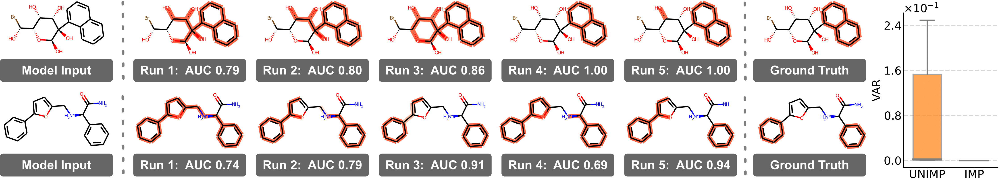

# Consensus-Driven Distillation for Trustworthy Explanations in Self-Interpretable GNNs

**💻 Official implementation of our TPAMI submission (extension of ICML 2025): Consensus-Driven Distillation for Trustworthy Explanations in Self-Interpretable GNNs**

> 🧠 Authors: [Wenxin Tai](https://scholar.google.com/citations?user=YyxocAIAAAAJ&hl=en), [Fan Zhou](https://scholar.google.com/citations?user=Ihj2Rw8AAAAJ&hl=en), [Ting Zhong](https://scholar.google.com/citations?user=Mdr0XDkAAAAJ&hl=en), [Goce Trajcevski](https://scholar.google.com/citations?user=Avus2kcAAAAJ&hl=en), [Kunpeng Zhang](https://scholar.google.com/citations?user=rnpemAoAAAAJ&hl=en&oi=ao), [Jing Gao](https://scholar.google.com/citations?user=Ftj1h4cAAAAJ&hl=en&oi=ao), [Philip S. Yu](https://scholar.google.com/citations?user=D0lL1r0AAAAJ&hl=en&oi=ao)   
> 📍 Institutions: University of Electronic Science and Technology of China & Iowa State University & University of Maryland, College Park & Purdue University & University of Illinois, Chicago.  
> 🔗 [Paper Link](https://icml.cc/virtual/2025/poster/44426)
> 🤖 This repository is maintained by [ICDM Lab](https://www.icdmlab.com/)

---

## 🧩 Overview

<p align="center">
  
</p>

**TL;DR: Our ICML paper proposed Explanation Ensemble (EE), which improves the trustworthiness of SI-GNNs by aggregating multiple explanations from independently trained models. While effective, it has high computational cost during inference (limits its deployment) and is incompatible with single-explanation metrics such as FID (limits its evaluation). In this extension, we propose Consensus Distillation (CD), which distills the ensemble’s consensus knowledge into a single model, retaining EE’s capability while addressing its limitations.

---

## 📦 Repository Structure

```bash
├── assets
├── configs         # configuration
├── criterion.py    # loss function
├── dataloader.py   # load data
├── dataset.py      # process data
├── datasets        # raw dataset
├── explainer.py    # explainer in self-interpretable GNNs (MLP)
├── main.py         # entry
├── model.py        # GNN backbone (GIN/GCN)
├── outputs         # checkpoints/logs
├── README.md
├── run.sh 
└── trainer.py      # train/valid/test
````

---

## ⚙️ Installation

We recommend creating a fresh Python environment (e.g., with conda):

```bash
conda create -n exgnn python=3.9
conda activate exgnn
pip install -r requirements.txt
```

---

## 📚 Datasets

We evaluate our method on a variety of datasets:

* Synthetic: BA-2MOTIFS
* Molecular: MUTAGENICITY, 3MR, BENZENE

Datasets can be downloaded from [Google Drive](https://drive.google.com/drive/folders/1RaOKbWABerHfea_sJZGIbXSy0FcOzK0O?usp=sharing), place all datasets (e.g., `ba_2motifs`, `benzene`, `mr`, `mutag`) in the `datasets/` folder.

---

## 🏃‍♀️ Quick Start

### 1. Train self-interpretable GNNs 

```bash
python main.py --run_time 10 --dataset ba_2motifs --method gsat_cd
```


### 2. Evaluate redundancy (SHD and AUC)

```bash
python main.py --run_time 10 --dataset ba_2motifs --method gsat_cd --calculate_shd
```

```bash
python main.py --run_time 10 --dataset ba_2motifs --method gsat_cd --test_by_sample_ensemble
```

---

## 📁 Pretrained Checkpoints
We provide **pretrained model checkpoints** for quick evaluation and reproduction.  

You can download them from the [Releases](https://github.com/ICDM-UESTC/ConsensusDistillation/releases) tab

To use the checkpoint, place it in the `outputs/checkpoints/` folder and run:
```bash
python main.py --run_time 10 --dataset ba_2motifs --method gsat_cd --calculate_shd
python main.py --run_time 10 --dataset ba_2motifs --method gsat_cd --test_by_sample_ensemble
```

---

## 📌 Citation

If you find this work useful, please cite us:

```bibtex
@inproceedings{tai2025redundancy,
  title     = {Redundancy Undermines the Trustworthiness of Self-Interpretable GNNs},
  author    = {Tai, Wenxin and Zhong, Ting and Trajcevski, Goce and Zhou, Fan},
  booktitle = {Proceedings of the 42nd International Conference on Machine Learning (ICML)},
  year      = {2025}
}
```

---

## 📬 Contact

If you have questions or suggestions, feel free to reach out via GitHub Issues or email: wxtai [AT] outlook [DOT] com